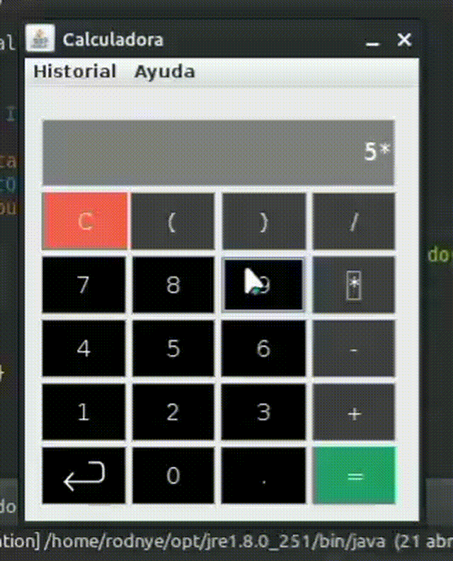

# **Calculadora Polinómica**  

  
Una calculadora simple con interfaz gráfica (Swing) para operaciones polinómicas básicas.  

  

---

## **📦 Requisitos**  
- **Java SE 6** (Recomendado: [Eclipse IDE](https://www.eclipse.org/downloads/))  
- **Swing** (Incluido en Java SE)  

---

## **🚀 Cómo Ejecutar**  
1. **Importar en Eclipse**  
   - Abre Eclipse y selecciona `File > Import > Existing Projects into Workspace`.  
   - Busca la carpeta del proyecto y haz clic en `Finish`.  

2. **Compilar y Ejecutar**  
   - Haz clic derecho en el proyecto y selecciona `Run As > Java Application`.  

---

## **🛠️ Características**  
- [x] **Operaciones básicas** (`+`, `-`, `*`, `/`) 
- [x] **Historial de cálculos** (Accesible desde el menú)  
- [x] **Interfaz minimalista** con botones intuitivos  
- [x] **Manejo de paréntesis** para operaciones complejas  

---  

🔹 *Ejecuta `src/init/Iniciadora.java` para iniciar la aplicación.*